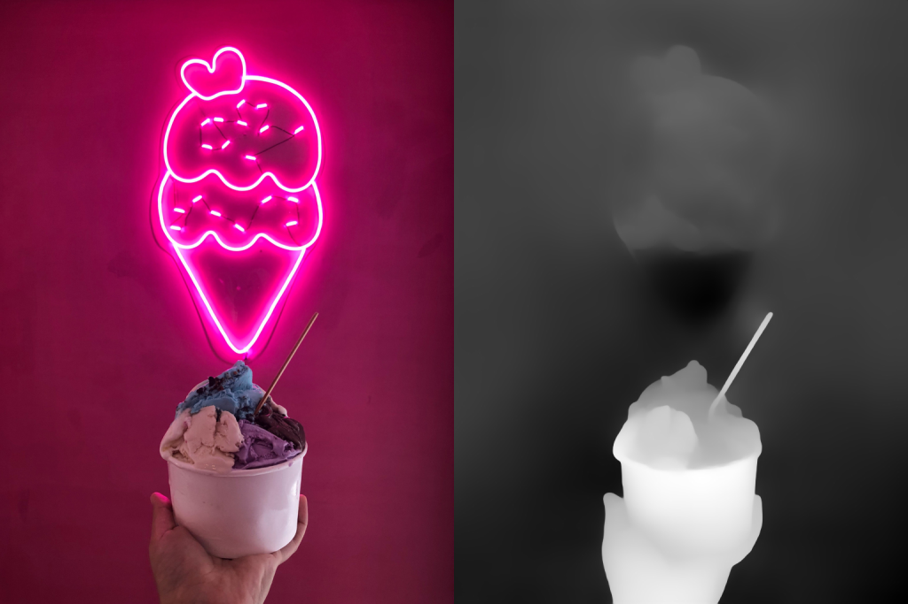

# Pexels Dataset

This GitHub repository contains image attributes for a dataset of [free-use](https://www.pexels.com/license/) stock photos. This dataset may be useful for image classification, image generation, object detection, and other related tasks. 

The dataset is available in two versions. One version has a minimum resolution of 512 pixels, while the other has a minimum resolution of 768 pixels. Both datasets have maximum dimensions that are multiples of 32.

### Kaggle Datasets

| Version | Source Images                                                | Depth Images                                                 |
| ------- | ------------------------------------------------------------ | ------------------------------------------------------------ |
| 512p    | [Pexels 110k 512p JPEG](https://www.kaggle.com/datasets/innominate817/pexels-110k-512p-min-jpg) | [Pexels 110k 512p JPEG Depth Maps](https://www.kaggle.com/datasets/innominate817/pexels-110k-512p-min-jpg-depth) |
| 768p    | [Pexels 110k 768p JPEG](https://www.kaggle.com/datasets/innominate817/pexels-110k-768p-min-jpg?select=pexels-110k-768p-min-jpg) | [Pexels 110k 768p JPEG Depth Maps](https://www.kaggle.com/datasets/innominate817/pexels-110k-768p-min-jpg-depth-dpt-hybrid) |

### Sample Image with Depth Map

    

### Sample Entry

|           |                                                                                                                                                                                                                                                                                                                                                       |
|-----------------|--------------------------------------------------------------------------------------------------------------------------------------------------------------------------------------------------------------------------------------------------------------------------------------------------------------------------------------------------------------|
| `img_id`          | 3186010
| `title`           | Pink and White Ice Cream Neon Signage                                                                                                                                                                                                                                                                                                                        |
| `aspect_ratio`    | 0.749809                                                                                                                                                                                                                                                                                                                                                     |
| `main_color`      | [128, 38, 77]                                                                                                                                                                                                                                                                                                                                                |
| `colors`          | [#000000, #a52a2a, #bc8f8f, #c71585, #d02090, #d8bfd8]                                                                                                                                                                                                                                                                                                       |
| `tags`            | [bright, chocolate, close-up, cold, cream, creamy, cup, dairy product, delicious, design, dessert, electricity, epicure, flavors, fluorescent, food, food photography, goody, hand, ice cream, icecream, illuminated, indulgence, light pink background, neon, neon lights, neon sign, pastry, pink background, pink wallpaper, scoop, sweet, sweets, tasty] |
| `adult`           | very_unlikely                                                                                                                                                                                                                                                                                                                                                |
| `aperture`        | 1.8                                                                                                                                                                                                                                                                                                                                                          |
| `camera`          | iPhone X                                                                                                                                                                                                                                                                                                                                                     |
| `focal_length`    | 4.0                                                                                                                                                                                                                                                                                                                                                          |
| `google_place_id` | ChIJkUjxJ7it1y0R4qOVTbWHlR4                                                                                                                                                                                                                                                                                                                                  |
| `iso`             | 40.0                                                                                                                                                                                                                                                                                                                                                         |
| `latitude`        | -7.746914                                                                                                                                                                                                                                                                                                                                                    |
| `longitude`       | 113.226906                                                                                                                                                                                                                                                                                                                                                   |
| `manufacturer`    | Apple                                                                                                                                                                                                                                                                                                                                                        |
| `medical`         | very_unlikely                                                                                                                                                                                                                                                                                                                                                |
| `orientation`     | 0.0                                                                                                                                                                                                                                                                                                                                                          |
| `racy`            | unlikely                                                                                                                                                                                                                                                                                                                                                     |
| `shutter_speed`   |                                                                                                                                                                                                                                                                                                                                                              |
| `software`        | 13.1.3                                                                                                                                                                                                                                                                                                                                                       |
| `spoof`           | very_unlikely                                                                                                                                                                                                                                                                                                                                                |
| `violence`       | very_unlikely                                                                                                                                                                                                                                                                                                                                                |
| `location`        | Kecamatan Mayangan, Jawa Timur, Indonesia                                                                                                                                                                                                                                                                                                                    |

